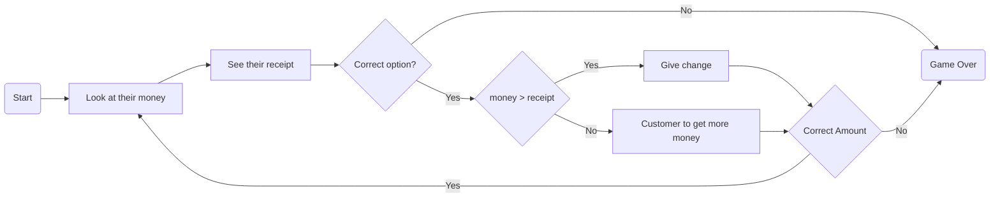

```mermaid
graph LR

Start(Start)-->Queue[Look at their money]
Queue-->Receipt
Receipt-->Choose{Correct option?}
Condition{money > receipt}

Choose-->|Yes|Condition
Choose-->|No|GameOver

Receipt[See their receipt]


Change[Give change]
Missing[Customer to get more money]
Condition-->|Yes|Change
Condition-->|No|Missing

Correct{Correct Amount}
Change-->Correct
Missing-->Correct

Correct-->|Yes|Queue
Correct-->|No|GameOver

GameOver(Game Over)

```
